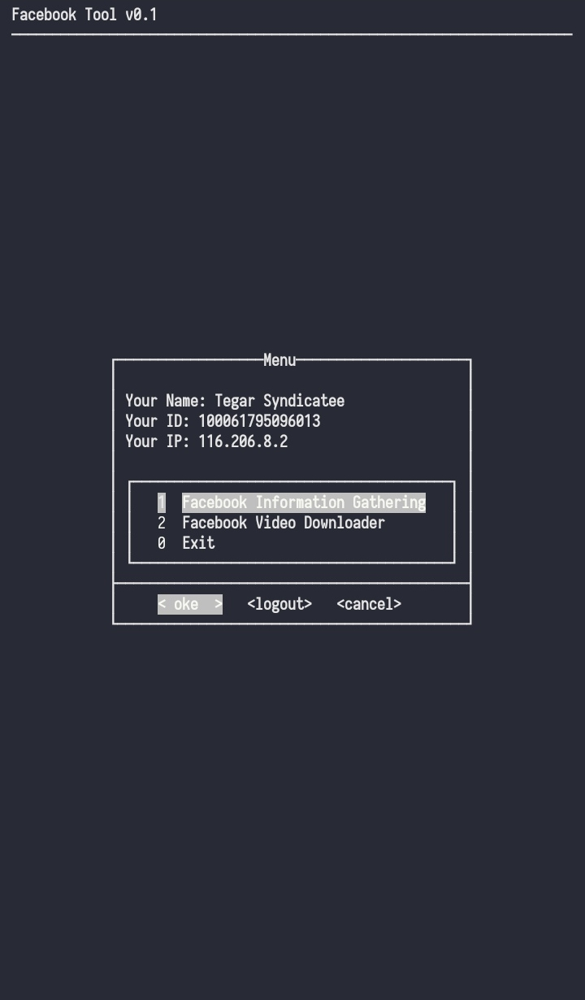
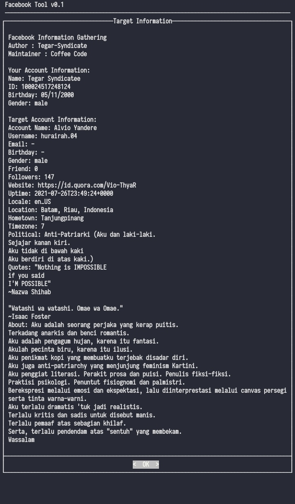

# informasi

Adalah sebuah tools yang menampilkan data-data tentang orang di facebook

# Gathering
Facebook Toolkit


<p align="center">
  <a name="top" href="#octocat-hi-there-thanks-for-visiting-">
     
     
  </a>
</p>

Thankz To Allah

Thankz To Mas Tegar

# Installation
<details open>
<summary> pydroid / termux (Android) / Linux / Windows</summary>

- ```bash
  $ apt update && apt upgrade
  ```

- ```bash
  $ apt install python
  ```

- ```bash
  $ apt install git
  ```

- ```bash
  $ pip install mechanize
  ```

- ```bash
  $ pip install bs4
  ```

- ```bash
  $ pip install requests
  ```

- ```bash
  $ pip install pythondialog
  ```

- ```bash
  $ git clone https://github.com/KangProf/informasi
  ```

- ```bash
  $ cd informasi
  ```

- ```bash
  $ python get.py
  ```
